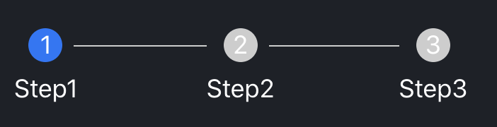

This project is a record of the common components that I implemented by react in my daily work.

# Available Components

## 1.Pop-Message

A pop message component, which can be used to show a success/warning/error/info message at the middle of the device screen.

### used like:

```
import messageApi from "./components/pop-message";

function App() {
  const popWarningMessage = () => {
    messageApi.warn("This is a warning message!", 1000000);
  };

  const popSuccessMessage = () => {
    messageApi.success("This is a success message!.");
  };

  return (
    <div className="App">
      <header className="App-header">
        
        <p>Example of message.</p>
        <button onClick={popWarningMessage}>click to pop a warning message.</button>
        <button onClick={popSuccessMessage}>click to pop a succeed message.</button>
      </header>
    </div>
  );
}
```

### Apis:

```
export interface MessageApi {
  /**
   * show diffent type of message(弹出不同类型的信息框)
   * @param content content of the message. (信息框内容)
   * @param duration How log the message will last. (在屏幕上的存在时间)
   * @param onClose callback when the message box is close. (关闭时触发的事件)
   */
  info(content: contentType, duration?: durationType, onClose?: () => void): () => void;
  success(content: React.ReactNode | string, duration?: durationType, onClose?: () => void): () => void;
  error(content: React.ReactNode | string, duration?: durationType, onClose?: () => void): () => void;
  warn(content: React.ReactNode | string, duration?: durationType, onClose?: () => void): () => void;
  warning(content: React.ReactNode | string, duration?: durationType, onClose?: () => void): () => void;
  open(args: HintArgs): void;

  //destroy the element register to the DOM.(销毁注册在DOM上的元素)
  destroy(): void;
}
```

### looks like:

**normal**:  


**multiple messages**:  


## 2.Steps

A component to show steps progress, supporting click event and step icon customize.  
Also Planning to add some style api such as direction to define the component's derection.

### Used like

```
const Demo: FC = () => {
  const [currentType, changeType] = useState('');
  return (
    <Steps current={stepCurrent}>
      <Step description="Step1"></Step>
      <Step
        description="Step2"
        onClick={() => {
          setStep(1);
        }}
      ></Step>
      <Step description="Step3"></Step>
    </Steps>
  );
};
```

### Api

```
//Steps api
interface IStepsProps {
  direction?: 'horizontal' | 'vertical'; //预留：指定步骤条方向。
  labelPlacement?: 'horizontal' | 'vertical'; //预留：指定标签放置位置，horizontal水平放图标，vertical 放图标下方
  size?: 'default' | 'small' | 'big'; //预留：指定大小
  current?: number; //指定当前步骤，从 0 开始记数。在子 Step 元素中，可以通过 status 属性覆盖状态
  onChange?: (current: number) => void; //点击切换步骤时触发
  children?: React.ReactNode;
  className?: string; //最外层元素className
}

//Step api
interface IStepProps {
  status?: 'wait' | 'process' | 'finish' | 'error'; //指定状态
  icon?: ReactNode; //指定图标
  description?: string | ReactNode; //step描述
  title?: string | ReactNode;     //step 标题
  stepNumber?: number;
  stepIndex?: number;
  disabled?: boolean; //预留
  onClick?: (next: number) => void;
}
```

### Looks like



## Img-Picker

A image upload and preview component.

### used like:

```
const Demo: FC = () => {
  const data = [];
  const [files, changeFiles] = useState(data);
  const onChange = (files, type, index) => {
    console.log(files, type, index);
    changeFiles(files);
  };

  return (
    <ImgPicker
      files={files}
      onChange={onChange}
      onImageClick={(idx, fs) => console.log(idx, fs)}
      selectable={files.length < 3}
    />
  );
};
```

### api:

```
export interface ImgPickerProps {
  style?: React.CSSProperties; //组件最外层div样式
  files?: Array<ImageFile>; //初始数据
  onChange?: (files: Array<ImageFile>, operationType: string, index?: number) => void;
  onImageClick?: (index?: number, files?: Array<ImageFile>) => void; //点击图片时回调
  onAddImageClick?: (e: React.MouseEvent) => void; //点击添加按钮时回调
  onFail?: (msg: string) => void; //上传失败时回调
  selectable?: boolean; //是否显示添加按钮，比如身份证正反面，上传2张后关闭添加功能
  multiple?: boolean; //同type=file时，input的multiple属性,是否多选
  accept?: string; //同type=file时，input的accept属性，接受文件类型
  capture?: boolean | string; //同type=file时，input的capture属性，调用摄像头相关
  disableDelete?: boolean; // 是否隐藏删除按钮，默认false
}
```

### looks like:

upload:  


preview:  

