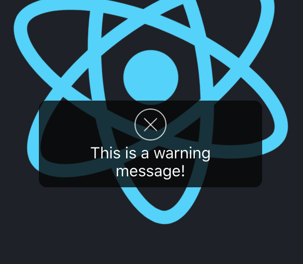

This project is a record of the common components that I implemented by react in my daily work.

# Available Components

## Pop-Message

A pop message component, which can be used to show a success/warning/error/info message at the middle of the device screen.

### used like:

```
import messageApi from "./components/pop-message";

function App() {
  const popWarningMessage = () => {
    messageApi.warn("This is a warning message!", 1000000);
  };

  const popSuccessMessage = () => {
    messageApi.success("This is a success message!.");
  };

  return (
    <div className="App">
      <header className="App-header">
        
        <p>Example of message.</p>
        <button onClick={popWarningMessage}>click to pop a warning message.</button>
        <button onClick={popSuccessMessage}>click to pop a succeed message.</button>
      </header>
    </div>
  );
}
```

### Apis:

```
export interface MessageApi {
  /**
   * show diffent type of message(弹出不同类型的信息框)
   * @param content content of the message. (信息框内容)
   * @param duration How log the message will last. (在屏幕上的存在时间)
   * @param onClose callback when the message box is close. (关闭时触发的事件)
   */
  info(content: contentType, duration?: durationType, onClose?: () => void): () => void;
  success(content: React.ReactNode | string, duration?: durationType, onClose?: () => void): () => void;
  error(content: React.ReactNode | string, duration?: durationType, onClose?: () => void): () => void;
  warn(content: React.ReactNode | string, duration?: durationType, onClose?: () => void): () => void;
  warning(content: React.ReactNode | string, duration?: durationType, onClose?: () => void): () => void;
  open(args: HintArgs): void;

  //destroy the element register to the DOM.(销毁注册在DOM上的元素)
  destroy(): void;
}
```

### looks like:

**normal**:  


**multiple messages**:

